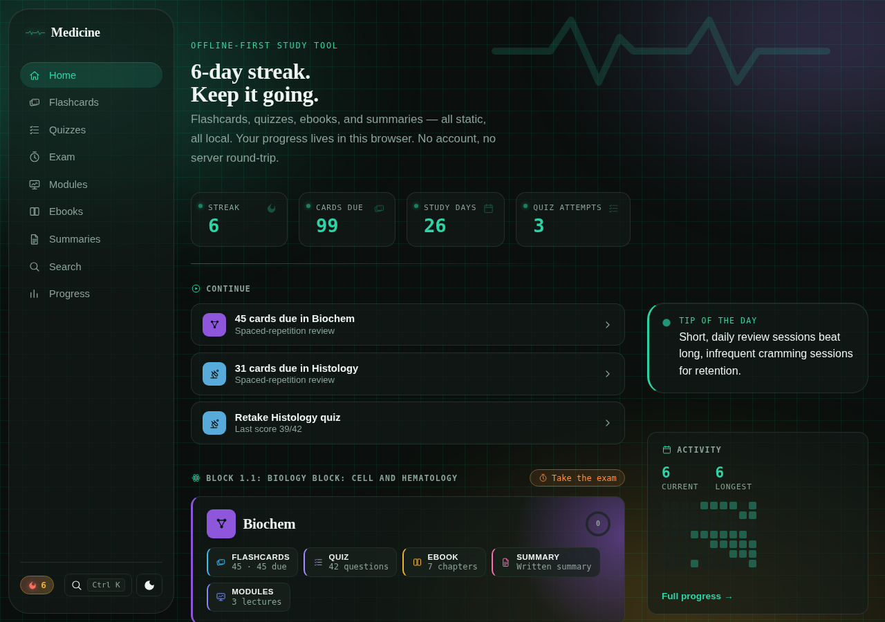
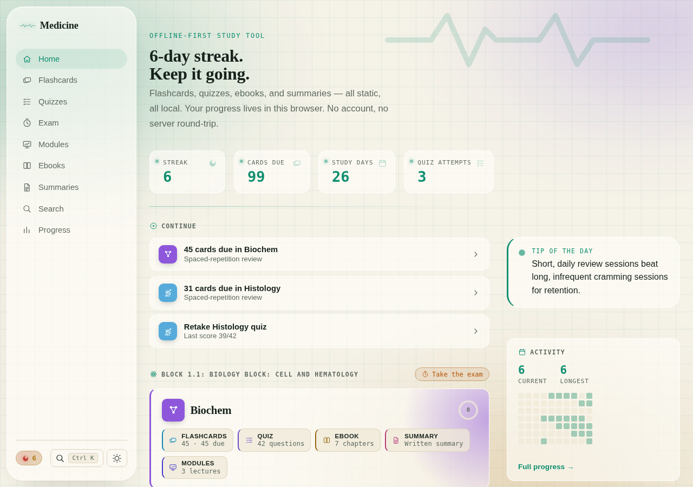
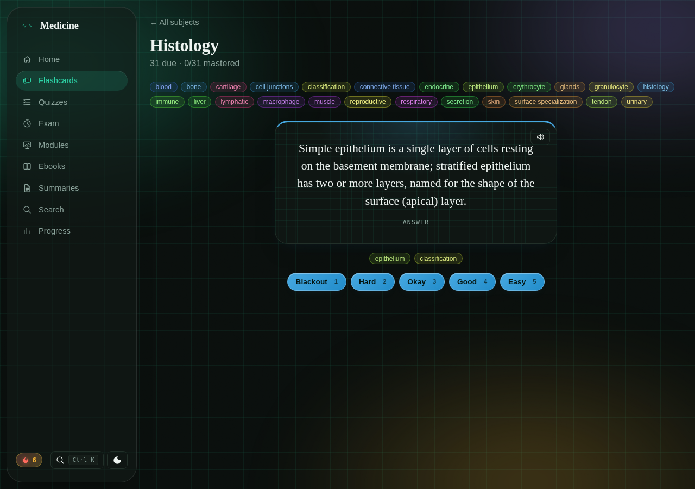
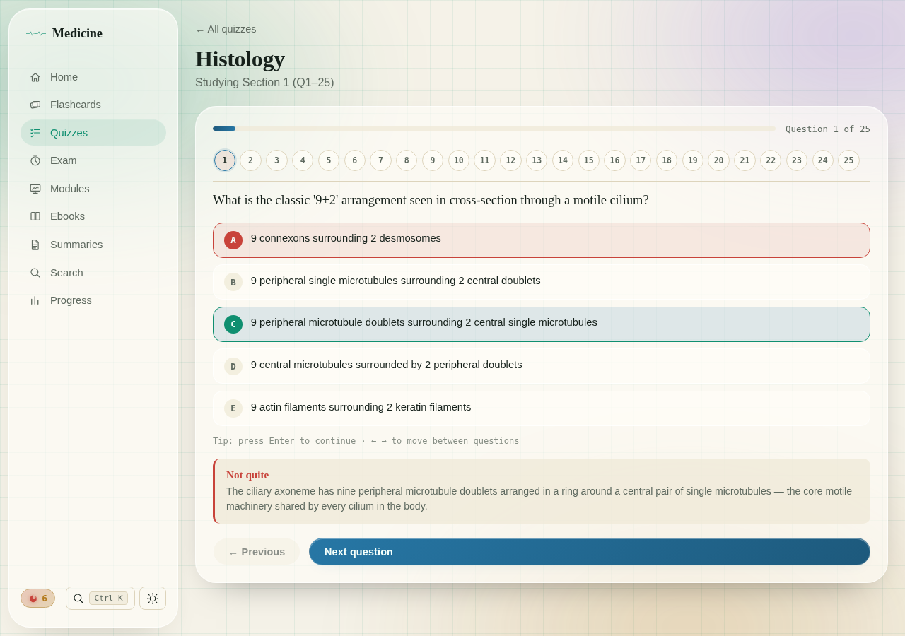
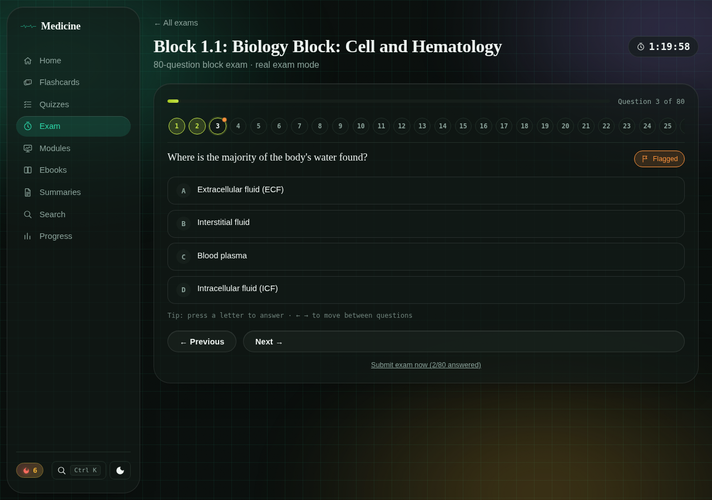
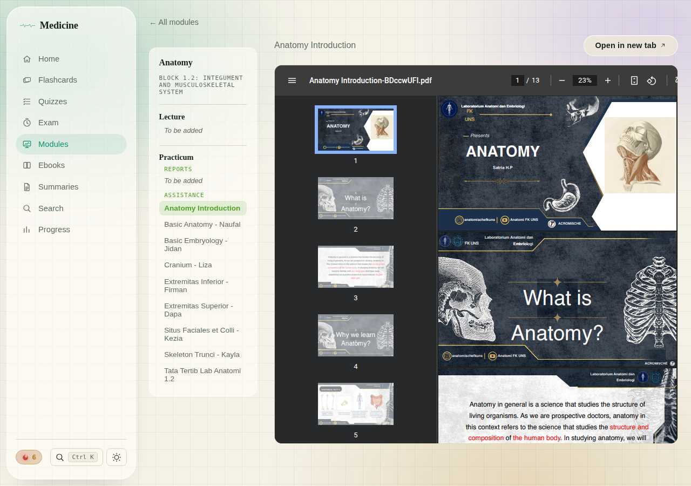
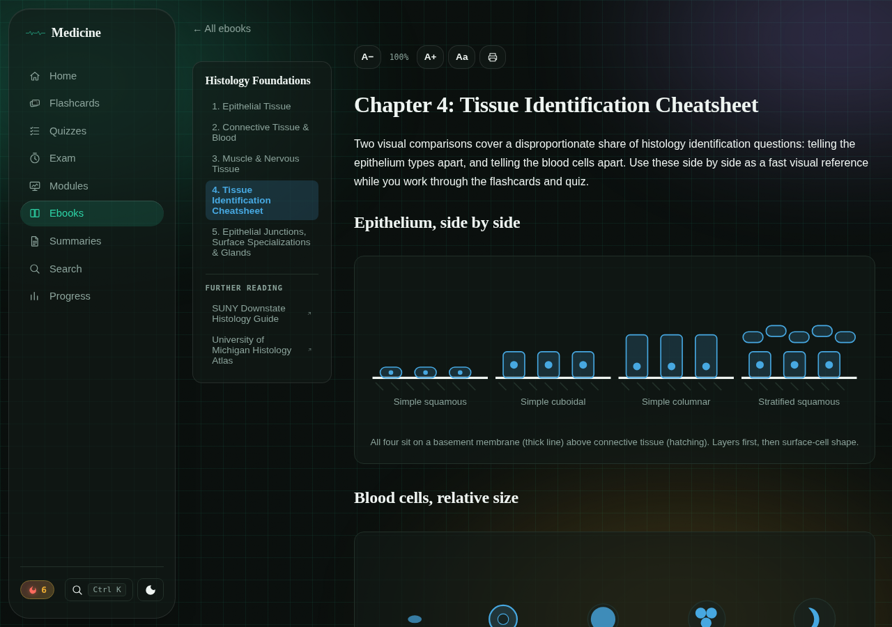
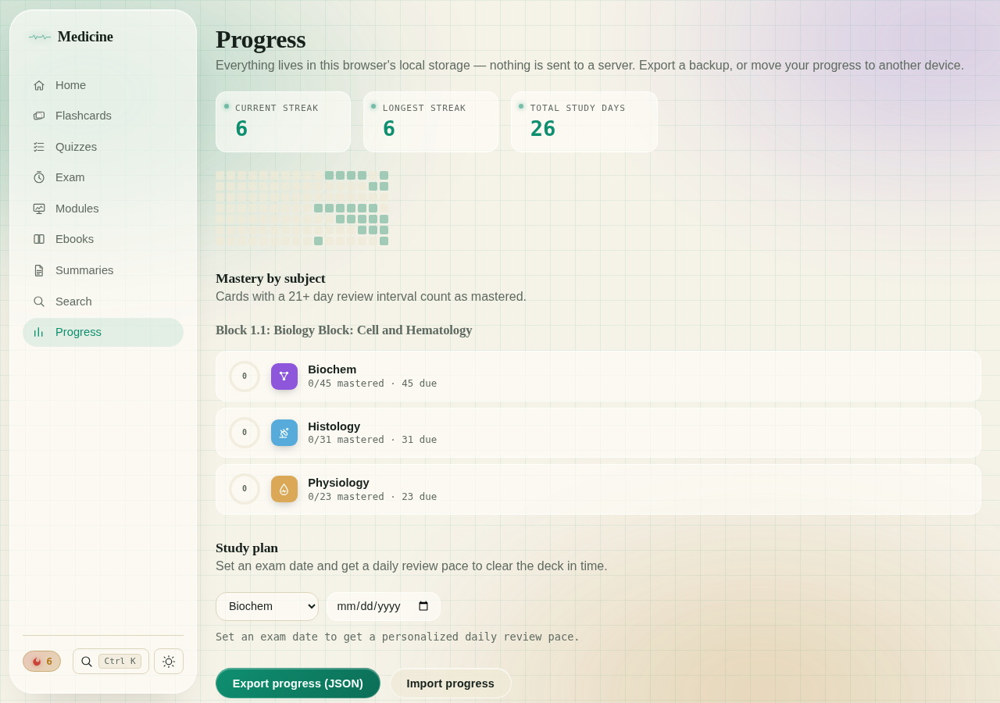

# Pendik: study tool for Pendik 26

[](./LICENSE)


The class app for the Pendik 26 medical students, organized the way the
curriculum is: by **study block**, then by **subject**. Each subject can have
spaced-repetition flashcards, quizzes, chaptered ebooks, summaries and the
original lecture and practicum PDFs. Each block has timed past-paper exams,
and the class's Google Drive is browsable in the app. Indonesian by default,
with an English toggle.

Only students on the class roster can sign in, with their NIM or a linked
Google account. Progress, exam attempts and the past papers live in one
Supabase project (Postgres with row level security, plus three Edge
Functions); study content ships with the site as JSON, Markdown and PDF
files. It installs as a PWA and works offline from what's already loaded.

## Screenshots

|  |  |
| --- | --- |
| **Home**: streak, due cards, what to continue, per-block subject cards | **Light theme**: follows the OS by default, toggle anytime |
|  |  |
| **Flashcards**: SM-2 review, tag filters, keyboard grading | **Quiz**: one question at a time, instant feedback with explanations |
|  |  |
| **Exam**: timed block exam, question navigator, flag for review | **Modules**: lecture and practicum PDFs, grouped by section |
|  |  |
| **Ebook**: chapters with original diagrams, reading controls, further reading | **Progress**: readiness, subject meters, trends, activity heatmap, weak spots, milestones, backup |

## What's inside

| Block | Subject | Content |
| --- | --- | --- |
| **1.1**: Cell Biology and Hematology | Histology | 31 flashcards · 170 quiz questions · 5-chapter ebook · summary · 3 lecture PDFs |
| | Biochemistry | 45 flashcards · 42 quiz questions · 7-chapter ebook · summary · 3 lecture PDFs |
| | Physiology | 23 flashcards · 26 quiz questions · 4 lecture PDFs |
| | *Block exam* | Past papers (Original Set, Costraver, UB 2025), imported by an admin into the database |
| **1.2**: Integument and Musculoskeletal System | Anatomy | 144 flashcards · 986 image-occlusion labels on 88 figures · 134 quiz questions · 7-chapter ebook (22 original diagrams, 153 slide figures) · summary · 9 practicum assistance PDFs |
| | Histology | 69 flashcards · 76 quiz questions · 6-chapter ebook on muscle tissue and the integument (44 slide figures) · summary · 2 lecture PDFs |
| | Physiology | 57 flashcards · 80 quiz questions (28 with slide figures, incl. skin physiology) · 5-chapter ebook on muscle contraction and reflexes (12 original diagrams, 41 slide figures) · summary · 3 practicum assistance PDFs · Virtual Lab (PhysioEx Exercise 2) |
| | *Block exam* | Pooled from the anatomy, histology and physiology quiz banks (100 Q) |
| **1.3**: Digestive System and Metabolism | — | Coming soon |

## Features

### Flashcards

- SM-2 spaced repetition with a due-card queue and a session summary
- Tag filtering (remembered per deck), with color-coded tag pills
- "Hardest cards" ranked by lapses, for each deck
- Optional card images and read-aloud (Web Speech API)

### Image Occlusion (anatomy)

- Anki-style: atlas figures with their labels covered; name the one under the
  red box, reveal it, grade it. Every label has its own SM-2 schedule, with the
  next interval shown on each grade button
- Review (what's due) or Browse all (every figure in order): previous/next label
  and figure, tap any box or numbered chip to ask that label, swipe on phones
- Gallery of every figure with its progress, colour-coded label chips (new, due,
  learning, mastered), undo the last grade, show every label to study a figure
  whole, zoom, hide all or one, filter by region; picks up where you left off

### Explain this (quizzes and flashcards)

- Shows the passages of the subject's own ebook and summary that match the
  question: free, instant, works offline
- Signed-in students can ask an AI to explain the answer (and why their pick was
  wrong), streamed in, grounded in those passages, with a daily allowance per
  student

### Alfond (study assistant)

- A chat that can be asked anything, from its own page or from a floating button
  on every page
- From the button, each question carries the text of the page on screen, so
  "what does this mean?" is about what you're reading (switch it off per
  question)
- One conversation across pages, kept on the device; stop, retry, new chat
- The floating button can be turned off on Alfond's page or in Account
- Signed-in students only, on the same daily AI allowance as "Explain this"

### Quizzes

- One question at a time with instant feedback and an explanation for every answer
- A numbered navigator, previous/next, and full keyboard control
- Question and option order reshuffled on every attempt, so answers can't be
  memorized by position
- Banks over 50 questions split into about 25-question sections you can take one
  at a time
- An unfinished attempt resumes where you left off
- "Review missed only" retry, and a due queue where missed questions come back
  until you answer them correctly
- Score-trend sparkline, question images (micrographs and diagrams), and
  confetti on a perfect score

### Exam

- Timed block exams: up to 100 questions at 1 minute each, scaled down for
  smaller banks
- **Past papers** (`/exam/papers`): exam and practice packages an admin
  imports from Markdown. The timer runs on the server, answers are graded in
  the database, and an exam's answer keys never reach the browser before it's
  submitted. One attempt runs at a time and can move between tabs; the best
  score is kept.
- Without packages, a block's exam pools its quiz banks.
- **Real exam** mode (scored only at the end) or **instant feedback** mode
- Flag for review, a navigator showing answered and flagged questions, and a
  low-time warning
- Submitting with questions unanswered or flagged asks for confirmation first
- Review with explanations after submitting, a "retry missed" round, and score
  history per package

### Modules

- The original lecture slides and practicum PDFs, viewable in-app with an "open
  in new tab" fallback
- Grouped as **Lecture**, then **Practicum** (Reports, Assistance), with empty
  sections marked "To be added"
- **Class Drive** (signed-in students): the class's Google Drive folder, live.
  Every slide deck, recording, tutorial and exam file, folder by folder, in
  Google's own viewer (← and → step through a folder, Esc closes). "New this
  week" and per-folder counts show what was just added until it's opened; `/`
  searches every file and folder name. Each subject's module page lists its
  Drive files above the cleaned PDFs. Files added to or removed from the Drive
  are copied into the database every morning by a sync, so students never
  call Google's API themselves
- Linked folders (any folder shortcut in the class Drive, such as past
  cohorts' Pendproduktif): their folders are listed, and each is read from
  Drive only when it's opened, so a big linked tree never crowds out this
  year's files

### Virtual Lab

- A practice simulator for the PhysioEx 9.1 Exercise 2 (skeletal muscle) dry
  lab: all seven activities, from the twitch and latent period to the
  load–velocity relationship
- A muscle on a force transducer with an oscilloscope trace, voltage, length,
  stimulus rate and weight controls, and a **Measure** line for the latent
  period
- Summation, unfused and fused tetanus, fatigue with rest periods,
  length–tension (active, passive, total) and isotonic lifts, from one tested
  model (`src/lib/muscleSim.ts`) tuned to the practicum's numbers (threshold 0.8
  V, maximal 8.5 V, 1.82 g twitch, optimal length 75 mm). Every equation and
  the numbers it gives are in [How the numbers are worked
  out](docs/calculations.md#virtual-lab-physioex-91-exercise-2-skeletal-muscle)
- **Record Data** into a table that is kept per activity, **Plot Data**, CSV
  download, and check questions with explanations

### Ebooks and summaries

- Chaptered Markdown with original inline SVG diagrams, a table of contents, and
  previous/next navigation
- Resume position and chapter-completion tracking
- Adjustable font size, an accessible-font toggle (Atkinson Hyperlegible), and
  print-friendly styling
- Optional PDFs and a "Further reading" list of external links

### Search and navigation

- Fuzzy search (Fuse.js) across every flashcard, quiz question, summary section
  and ebook chapter, with type and subject filters
- A **⌘K / Ctrl+K** command palette to jump to any page or subject
- A collapsible sidebar that shrinks to an icon rail on desktop (remembered
  between visits), giving pages such as the ebook reader a wider column

### Help (`/docs`)

- Built-in help for students: a page for every part of the app (getting
  started, each study mode, the exam plan, accounts and sync, privacy,
  troubleshooting), with search, contents and previous/next, written as
  Markdown in `content/help/`

### 3D anatomy (`/atlas`)

- The whole body in 3D from [Z-Anatomy](https://www.z-anatomy.com/): skeleton,
  joints and ligaments, muscles, heart and vessels, nerves, organs, lymphatic
  system, skin and regions, about 1,800 named structures
- Each body system loads only when switched on (the skeleton alone is
  1.4 MB, everything about 15 MB) and is kept for offline use; per-system
  opacity and groups (the fasciae start hidden)
- Drawn in batches (a few draw calls per system), so even the whole body
  turns smoothly on a phone; hover lights a part, double-click flies to it,
  and keyboard shortcuts for search, focus, hide, only this and the views
- Easy to move around: zoom and turn buttons, arrow keys, the view turns
  around the part you click, a label for the side facing you (anterior,
  left…), full screen, back and forward through what you opened, and a
  recently opened list
- Click or search any structure: its name, side and group, a short
  description, focus, only this, hide, and Ask Alfond
- 786 bony landmarks, and "Where it attaches" shows a muscle's origin and
  insertion areas on the bones
- Views from the front, back, sides and top; the page's address keeps the
  systems and the selected structure
- The models are CC BY-SA 4.0 (with non-commercial parts), not MIT: see
  `public/atlas/LICENSE.txt` and [docs/atlas-3d.md](docs/atlas-3d.md)

### Knowledge map (`/map`)

- One graph of every concept across all blocks and subjects (about 700), from
  the terms the ebooks and summaries put in bold, linked where they come up
  together in a paragraph, flashcard or quiz question; a concept taught in two
  subjects or blocks is one dot that joins them
- Built at deploy time into `/knowledge-graph.json` (2D and 3D layouts
  included, so both views open at rest; sections listed once and cited by
  number, about 100 KB gzipped); past-paper exam questions are never read
- Laid out like an Obsidian vault: a ribbon of tools, a concept explorer with
  blocks and subjects as folders, the graph view, and the open concept as a
  note (properties and tags, links as wikilinks, practice, and "linked
  mentions" for every section that teaches it)
- A live graph: hover to light a concept's neighbourhood (with a card saying
  what it is), drag a concept and its links pull the others after it, labels
  fade in with zoom, and a local graph of one concept and its neighbours
- A real 3D view: subjects spread out in space over a floor grid, an orbit
  camera like Blender or Unity (drag to orbit, right-drag to pan, scroll to
  zoom, W A S D Q E to fly, numpad-style 1 3 7 views, perspective or
  orthographic, auto-rotate) and an axis gizmo; drawn on a plain canvas
- Every concept has a short "What it is" line, from
  `content/graph/glossary.json` or else the clearest definition in the notes
- In the app's own colours, light and dark; a 3D effect toggle (lit spheres
  and depth) for lighter drawing on slow devices; the map rests when nothing
  moves, so it costs nothing idle
- Obsidian-style graph settings, kept per device and synced: filters (text,
  block, subject, bridges only, orphans), groups (color by subject or by your
  own mastery, weak concepts ringed), display (3D effect, text fade, node
  size, link thickness) and forces (center, repel, link force, link distance)
- **Ask Alfond about** a concept, at the top of its note: how it connects to
  its neighbours, short and exam-focused
- Full screen, with the browser's own full screen or (on iPhone) the map
  covering the page
- Optional AI relationship labels ("innervates", "part of"…): `AI_BASE_URL=…
  AI_API_KEY=… AI_MODEL=… npm run graph:relations`, then commit
  `content/graph/relations.json`

### Exam plan (`/plan`)

- One exam date per block: the block's official date (`examDate` in
  `src/lib/blocks.ts`) unless the student sets their own
- A readiness score per subject and block, from card and image-occlusion
  mastery, quiz accuracy and coverage, chapters read and timed mock scores (the
  formulas are in [Readiness and the exam
  plan](docs/calculations.md#readiness-and-the-exam-plan))
- **Today's plan**, at the top of Home as the next step with a Start button
  and at the end of every session as "Up next": a checklist sized to the
  minutes the student has, which ticks itself off as they study and spreads a
  missed day over the days left
- Phases that change the plan as the exam nears: Learn (new material) →
  Strengthen (2 weeks out: weak spots) → Mock exams (last 3 days) → Final review
- Mock score trend against a target score, projected to exam day
- Weak spots by name (flashcard topics, most-missed questions, slipping labels),
  each with a one-tap drill
- "Add to calendar" (.ics), "Plan my week with Alfond", and readiness against
  the class average (signed in; shown once 3+ classmates have one)

### Progress

- A summary of the current block (readiness, countdown, weakest subject) and
  every subject with meters for cards, labels, quiz, reading and mocks
- This week against last week, reviews per day, quiz and mock score trends
- An activity heatmap shaded by how much was studied; tap a day to see what; the
  time of day you study most
- Weak spots, milestones, and "Ask Alfond about my progress"
- Export and import of all progress as a JSON file, plus a reminder if you
  haven't backed up in 14 days

### Accounts

- Roster only: an admin adds the class list and activates students. A student
  signs in with their NIM and the first password `pendik26` + NIM, then picks
  their own
- Google sign-in once it's linked from the Account page
- Progress (flashcard reviews, quiz history, reading, streak days, settings
  that follow you) is saved in the account only, a moment after each change,
  with the save state and **Save now** on the Account page
- "Sign out and clear this device" for shared computers, and download all
  account data
- A "current block" setting that puts your block first on Home and drives the
  daily plan
- Opt-in **leaderboard**: this week, all time and study streak, for everyone or
  just your cohort. Points are worked out in the database from saved progress
  (1 per correct answer, 2 per learned flashcard or label, 10 per finished
  chapter, 5 per study day; see
  [Leaderboard](docs/calculations.md#leaderboard)), and you choose the
  display name

### Admin (`/admin`)

- **Students:** paste the roster, activate accounts, lock, unlock, reset a
  password, make admins
- **Import:** past papers and practice sets as Markdown
  ([format](docs/questions.md)), checked line by line before saving
- **Packages:** edit questions, set the time, publish
- **Drive:** the sync's runs, run one now, or let a held run go ahead

### App

- Installable PWA that works offline after the first visit (details in [Offline
  and updates](docs/architecture.md#offline-and-updates))
- Light and dark themes, with a color per content type and per subject
- Blocks with no content yet appear as "coming soon" placeholders
- A recovery screen instead of a blank page if something breaks
- Every page's footer shows the current block and the version and build
  (`v0.1.49 · build fb0fd76`: the version counts commits, the build links to
  the commit; see [Version and
  build](docs/deploying.md#version-and-build))

## Documentation

- **Students:** open **Help** in the app (`/docs`).
- **Adding study material:** the [content guide](docs/content-guide.md);
  past papers: [writing exam questions](docs/questions.md).
- **Developers:** [architecture](docs/architecture.md),
  [development](docs/development.md), [storage and
  saving](docs/storage-and-sync.md), the [database](docs/database.md), the
  [server API](docs/api.md), the [3D anatomy atlas](docs/atlas-3d.md), and
  [how the numbers are worked out](docs/calculations.md), every formula from
  the Virtual Lab to leaderboard points.
- **Setting it up:** [deploying](docs/deploying.md), from a new Supabase
  project to the first admin.

All of it is also on the [wiki](https://github.com/Pendik26/pendik-app/wiki),
regenerated from `docs/` and `content/help/` on every push.

## Quick start

```bash
git clone https://github.com/Pendik26/pendik-app.git
cd pendik-app
npm install
cp .env.example .env.local   # fill in VITE_SUPABASE_URL and the publishable key
npm run dev                  # http://localhost:5173
```

Every page needs sign-in, so the app needs a Supabase project: a hosted one
(see [deploying](docs/deploying.md)) or a local one with `supabase start`.
Scripts, tests and conventions are in [development](docs/development.md).

## Adding content

Everything under `content/` is found at build time, so adding a file is
enough: no code changes. Where each kind of material goes, its format and the
privacy checklist are in the [content guide](docs/content-guide.md).

> **Before adding PDFs from a course,** check them for personal data. Lab and
> class decks often include assistants' profiles, phone numbers, birth dates,
> or group invite links and QR codes. Remove those pages first: this repo is
> public, and the files are served as-is.

## Data and privacy

- Progress, exam attempts and settings that follow you are stored in the
  Supabase database under your account, with your NIM, name, class and cohort
  from the roster. Row level security lets each student read only their own
  rows; admins see the roster and account states, not anyone's answers.
- This device keeps only its own settings (theme, language, sidebar, recent
  pages); resetting them never touches your progress.
- Nothing is shared with classmates unless you join the leaderboard, which
  shows your chosen display name, cohort and scores (never your NIM or
  answers). Leave it any time. **Account → Download my data** exports
  everything saved in your account.
- The [Privacy Policy](public/legal/privacy.html) and
  [Terms of Service](public/legal/terms.html) are static pages in
  `public/legal/`, served at `/privacy` and `/terms`; update them if what the
  app stores changes.
- Study content is the same for everyone and is part of the built site, so
  anyone with a file's address can fetch it. Past-paper questions and keys
  are only in the database.

## Contributing

- **Content** (flashcards, questions, chapters, summaries, PDFs) never needs a
  code change. Follow the [content guide](docs/content-guide.md), including its
  privacy checklist.
- **Code:** keep pure logic in `src/lib` with a matching `*.test.ts`, follow
  the [conventions](docs/development.md#conventions), and run the full check
  before opening a PR:

  ```bash
  npm run lint && npm run test && npm run build
  ```

- Open an issue first for changes to the data model (`src/types/content.ts`)
  or the content folder layout.

## License

The code and the original study material written for this app (flashcards,
quiz questions, ebook chapters, summaries, diagrams) are [MIT](./LICENSE)
licensed.

The PDFs under `content/modules/` are lecture and practicum materials from
their respective lecturers and lab assistants. They remain their authors'
work, are included only as study references, and are not covered by the MIT
license. The same applies to the slide figures under `public/ebook-figures/`,
which are cropped from those decks (many reproduce figures from published
atlases and textbooks); each is captioned with its source deck and slide. The
anatomy quiz figures in `public/ebook-figures/anatomy-quiz/` come from the same
decks, some with labels covered by a "?" so the figure doesn't give the answer
away. To have a file removed, open an issue.

The 3D anatomy models and descriptions in `public/atlas/` are adapted from
[Z-Anatomy](https://www.z-anatomy.com/) (itself based on BodyParts3D, © The
Database Center for Life Science) and are under
[CC BY-SA 4.0](https://creativecommons.org/licenses/by-sa/4.0/), not MIT. Some
parts are non-commercial, so the atlas may not be used commercially. See
[`public/atlas/LICENSE.txt`](public/atlas/LICENSE.txt).
